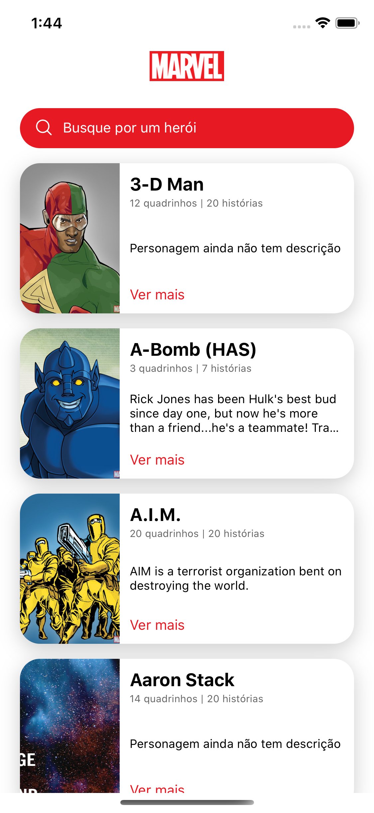
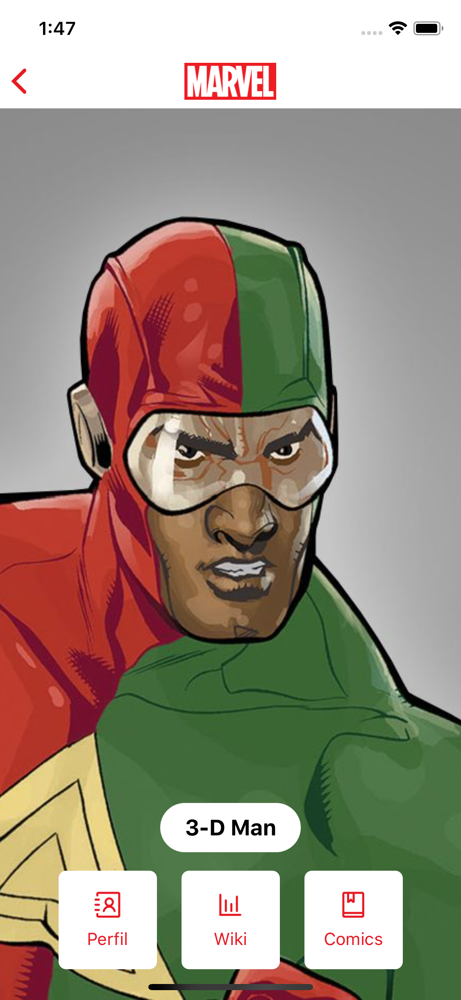
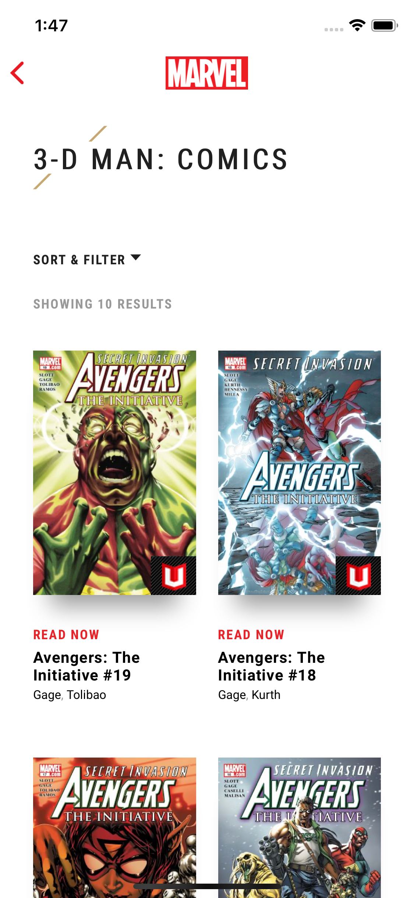

# marvel-api-mobile
> Consuming Marvel API with React Native

<p style="text-align: center;">
  
  
  
</p>

## Setup
1. Crie um arquivo `.env` a partir do `.env.example` e preencha as variáveis corretamente
2. Rode o ambiente localmente
```bash
# iOS
react-native run-ios --simulator "iPhone X"

# Android
react-native run-android
```
